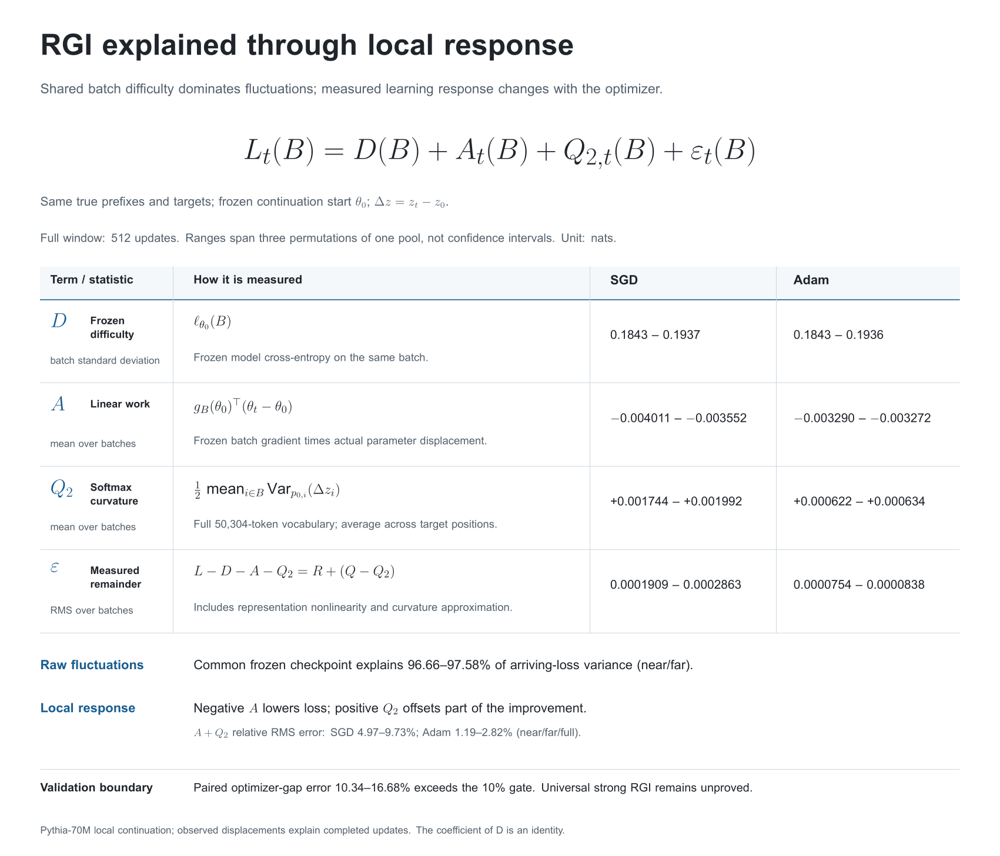

# RGI-explained

**Beyond Relative Generalization Invariance: Shared Difficulty and Local Learning Response in Language Model Training**

Shaoyang Guo and Ziming Liu are the core contributors. Ziming Liu is the corresponding author.

This release contains the MetaCircle manuscript, Chinese report, interactive panel and bounded aggregate evidence. It studies a finite teacher-forced Pythia-70M continuation with SGD and Adam.

[English webpage](https://guoshaoyang-pku.github.io/RGI-explained/?lang=en) · [中文网页](https://guoshaoyang-pku.github.io/RGI-explained/?lang=zh) · [Paper PDF](main.pdf)

The visual abstract centers on L = D + A + Q₂ + ε. The table separates measurement definitions from standard deviation, mean, and RMS. Its ranges use the full 512-batch window and three permutations of one shared data pool; they are not confidence intervals.

中文：冻结难度 D 主导原始 loss 的波动；扣除 D 后，负的一阶作用 A 与正的曲率项 Q₂ 共同解释局部响应。主图逐项给出测量公式、SGD/Adam 数量级和实测余项，并保留优化器差值检验的失败结果。

## Result and scope

A common official step-32000 reference explains 96.657–97.578% of near-window and 96.745–97.582% of far-window raw arriving-loss variance. After subtracting each algorithm frozen start, observed-displacement A+Q₂ has 4.97–9.73% relative RMS error for SGD and 1.19–2.82% for Adam.

The response analysis is retrospective. A+Q₂ uses the displacement that actually occurred. The experiments do not establish universal strong RGI or equal first-order dynamics coefficients across algorithms. Scalar-probe, optimizer-difference and known-teacher constant-offset failures are retained.

## Read

- [Bilingual visual abstract page](docs/index.html): English and Chinese explanations; desktop and mobile layouts.
- [English SVG](docs/assets/visual-abstract-en.svg) / [PDF](docs/assets/visual-abstract-en.pdf) · [中文 SVG](docs/assets/visual-abstract-zh.svg) / [PDF](docs/assets/visual-abstract-zh.pdf).
- [Exact visual-abstract values](docs/assets/visual-abstract-data.json), generated from the included analyses by [build_visual_abstract.py](docs/assets/build_visual_abstract.py).
- [Manuscript PDF](main.pdf)
- [Chinese report](docs/reports/rgi-followup.md)
- [Interactive panel](docs/reports/rgi-followup-panel.html): open in a browser, switch real trajectories, and export CSV.
- [Numerical summary](evidence/numerical-theory-summary.json)
- [Evidence scope](evidence/experiment-summary.md)

## Build and check

Prerequisites: Python 3.9+, XeLaTeX and latexmk with the packages used by metacircle.sty. No credentials or application environment variables are required.

    ./setup.sh
    python3 verify_evidence.py
    latexmk -xelatex -interaction=nonstopmode -halt-on-error main.tex

The arXiv zip includes main.bbl and a XeLaTeX compiler declaration. references.bib is included for local edits.

The static webpage needs no application dependencies. Open docs/index.html directly, or run python3 -m http.server from the repository. GitHub Pages can serve main at the repository root using index.html and .nojekyll. The optional manual Pages workflow checks release evidence before publishing; it exposes the manuscript and evidence links together with the website.

## Evidence availability

Included files contain aggregate arrival, local-work and paired-prefix analyses; figure values; bounded selection provenance; and verifier count/scope extracts. [source-provenance.json](evidence/source-provenance.json) records original and sanitized hashes. Claims identify whether each original source is included.

Raw checkpoints, full logits, producer traces, training data text and complete training scripts are not included. The checker verifies package integrity and recorded arithmetic; it does not rerun gradients or model trajectories. This is a manuscript and aggregate evidence release, not a complete training reproduction package.

## License and contributions

Original code and documentation use MIT; see [LICENSE](LICENSE). See [NOTICE.md](NOTICE.md) for third-party branding and citations. No blanket MIT grant is claimed for the Tsinghua or MetaCircle marks.

See [CONTRIBUTING.md](CONTRIBUTING.md). When using Codex or Claude Code, read [AGENTS.md](AGENTS.md) and preserve the evidence boundaries.
