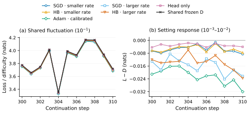

# RGI-explained

**Explanation of RGI: Shared Batch Difficulty and Setting-Dependent Gaps**

Shaoyang Guo is the sole core author. Ziming Liu is the corresponding author.

From one late Pythia-70M checkpoint, six training settings restart on identical data with a new warmup. Shared frozen difficulty dominates raw loss variation. The measured response and its approximation error depend on the training setting and displacement scale. Low-rate SGD/momentum alignment does not produce a constant nonzero token-loss gap in these continuations.

[English webpage](https://guoshaoyang-pku.github.io/RGI-explained/?lang=en) · [中文网页](https://guoshaoyang-pku.github.io/RGI-explained/?lang=zh) · [Paper PDF](paper/main.pdf) · [arXiv source zip](paper/rgi-followup-arxiv.zip)

## Visual abstract

$$L_t(B)=D(B)+A_t(B)+Q_{2,t}(B)+\varepsilon_t(B).$$

| Term | Measured quantity |
|---|---|
| **D · Shared frozen difficulty** | Frozen-checkpoint cross-entropy on the same true prefixes and targets. |
| **A · Linear parameter response** | Frozen batch gradient dotted with the actual parameter displacement. |
| **Q₂ · Logit variance cost** | Half the full-vocabulary variance of the observed logit displacement under frozen probabilities. |
| **ε · Measured remainder** | L − D − A − Q₂, split into network nonlinearity R and softmax error Q − Q₂. |

The homepage encodes the visual abstract directly as selectable HTML with normal-size text. A front figure shows the measured shared-loss fluctuation and setting response on the same eleven intermediate-protocol batches.

At steps 300–310 of registered permutation zero, frozen D has std 0.229 nats (10⁻¹ scale). Mean checkpoint-relative responses span −0.00309 to −0.02236 nats, with several average setting contrasts at the 10⁻³–10⁻² scale. The response also varies by batch; these are measured average offsets. The terminal protocol below has smaller responses.

The four-term figure uses two equal-width columns: an overview of steps 0–300 with raw observations and 20-step presentation means, and eleven raw observations at steps 300–310. Colors and marker shapes distinguish all six settings; every method curve is solid. The registered 64-step scientific analysis remains unchanged. Frozen D changes only when the scored batch changes; the fixed-probe companion uses its original observed readouts.

The terminal protocol uses smaller SGD/normalized-HB effective h = 3 × 10⁻⁸, calibrated Adam η = 3.02668 × 10⁻⁹, and head-only SGD η = 3 × 10⁻⁸. Values below are nats over all 512 arrivals. Ranges span three permutations of one reused pool; they are not confidence intervals. Different rows deliberately use different statistics.

| Term/statistic | SGD | Normalized HB | Adam | Head-only SGD |
|---|---|---|---|---|
| D · batch standard deviation | 0.18530–0.18634 | shared | shared | shared |
| A · signed mean | −1.7783 to −1.7613 × 10⁻⁴ | −1.7593 to −1.7481 × 10⁻⁴ | −6.5959 to −6.5632 × 10⁻⁴ | −9.4748 to −9.3932 × 10⁻⁵ |
| Q₂ · mean | 1.0801–1.2629 × 10⁻⁵ | 1.0746–1.2552 × 10⁻⁵ | 1.1175–1.1333 × 10⁻⁵ | 1.4350–1.4546 × 10⁻⁶ |
| ε · RMS | 2.4217–3.4880 × 10⁻⁵ | 2.4265–3.5303 × 10⁻⁵ | 2.6141–2.8720 × 10⁻⁶ | 2.7625–2.8632 × 10⁻⁹ |

The tenfold larger SGD / HB effective rates produce 30.52–35.72× terminal full-window mean Q₂, corresponding to 5.52–5.98× weighted RMS centered logit displacement. Q₂ scales quadratically with a fixed logit displacement; accumulated gradient paths do not preserve a simple squared-learning-rate ratio. A labeled smaller-setting inset keeps the low curves visible.

The exact response is M = L − D = W + Q = A + R + Q. Thus ε = R + (Q − Q₂). ε generally includes second-order network curvature; it is not generically a cubic remainder. The head-only control makes logits affine in the updated parameters and removes R to numerical precision.

## Common checkpoint and retained failures

Official Pythia-70M step 143000; FineWeb sample-10BT; 256 tokens per document and 223 scored targets; batch 8; 512 updates; optimizer states reset; 32-update warmup. Six settings are SGD and normalized Heavy Ball at two rates, calibrated Adam, and output-head-only SGD. Adam matches the initial single-step Q₂ on calibration documents, not trajectory progress or a scalar dc gain.

Three rate protocols were registered adaptively as approximation failures became visible. All 54 trajectories are included. The smaller SGD/HB effective rates are 3 × 10⁻⁴, 3 × 10⁻⁶, and 3 × 10⁻⁸. Fixed update counts do not match effective progress, and these rate labels are not measured stability regimes.

At the terminal scale D explains >99.9926% of raw arriving-loss variation. Full-window RMS(ε)/RMS(L − D) is 10.51–14.96% for SGD and 10.56–15.21% for HB, failing the registered 10% gate. Adam passes at 0.3387–0.3748%, and head-only SGD passes at 0.002410–0.002470%. Earlier, larger-displacement failures remain in the paper and evidence.

The terminal smaller-rate SGD/HB endpoint displacement cosine is 0.999706–0.999809. Their paired token-gap standard deviation divided by absolute mean is 46.49–163.48, above the 0.1 gate. None of the 45 terminal paired method/permutation tests passes that constant-gap test. Raw-loss similarity and endpoint alignment therefore do not establish strong RGI here.

中文：所有设置从同一个晚期 checkpoint 出发，重置优化器并重新 warmup。D（冻结模型对当前 batch 的 loss）完全共享，主导原始 loss 波动。A、Q₂ 与 ε 分别显示训练设置的响应和误差。只训练输出头的对照消除了网络非线性项。低率 SGD/HB 的终点位移已高度对齐，但严格的非零常数 token loss 差仍未通过。完整数值、四条曲线和失败范围见[中文网页](https://guoshaoyang-pku.github.io/RGI-explained/?lang=zh)。

## Read and inspect

- [Bilingual native visual abstract](docs/index.html) and [Chinese summary](docs/reports/rgi-followup.md).
- [Manuscript](paper/main.pdf), [source archive](paper/rgi-followup-arxiv.zip), and [submission metadata](paper/arxiv-metadata.txt). The archive has not been submitted to arXiv.
- [Terminal compact evidence](evidence/common-local), [intermediate protocol](evidence/common-refinement), and [initial protocol](evidence/common-initial).
- [Current claims](evidence/common-claims.json), [source provenance](evidence/common-source-provenance.json), and [evidence scope](evidence/experiment-summary.md).
- [Literature audit](evidence/literature-audit.md) and [same-stream momentum identity](evidence/momentum-alignment-bound.md).
- [Historical interactive diagnostics](docs/reports/rgi-followup-panel.html): earlier optimizer-specific starts and known-teacher experiments, not the main common-checkpoint experiment. Older visual-abstract exports in docs/assets/ are historical too.

## Check and build

Recorded-evidence verification requires only Python 3.9+ and the standard library. No credentials are required.

    ./setup.sh
    python3 verify_evidence.py
    python3 -m http.server 8000

Open docs/index.html to read the static site. To rebuild the paper, install XeLaTeX and latexmk with the packages required by paper/metacircle.sty, then run:

    latexmk -cd -xelatex -interaction=nonstopmode -halt-on-error paper/main.tex

All manuscript sources, figures, template assets, PDF, compiler declaration, and submission metadata live under paper/. The source archive includes main.bbl and has been built in an isolated directory.

The included scientific producer, full-logit checker, and plotting source under experiments/common_checkpoint/ require NumPy, PyTorch/CUDA, and Matplotlib as applicable. The original producer additionally requires checkpoint/data inputs that are omitted. The advanced checker requires full logit fixtures that are omitted. Use the root standard-library checker for the compact public package; the source files document the recorded experiment, not a one-command training reproduction.

## Evidence boundary

The common protocols include all 54 batch traces, fixed-probe readouts, document/token scalar NPZ arrays, registration/summary records, plots, and aggregate statistics. Private hardware/path identifiers have been removed; scientific values are retained. Source and public hashes record that transformation.

Raw training text and token spans, checkpoints, full-vocabulary logit fixtures, and parameter endpoints are omitted. The original independent checker reports 6,834 saved-evidence checks, including full-vocabulary reconstruction of final eight-token fixtures. The public checker verifies package hashes and recorded arithmetic. Neither independently replays all gradients or optimizer trajectories. Actual displacements make the response analysis retrospective. Three permutations reuse one pool and do not constitute a fresh held-out replication. This is a finite continuation from a late Pile checkpoint on FineWeb, not a reproduction or universal falsification of the original RGI paper.

## License

Original code and documentation use MIT; see [LICENSE](LICENSE). [NOTICE.md](NOTICE.md) preserves third-party branding and citation scope. No blanket MIT grant is claimed for the Tsinghua or MetaCircle marks. Contributions should follow [CONTRIBUTING.md](CONTRIBUTING.md) and [AGENTS.md](AGENTS.md).
