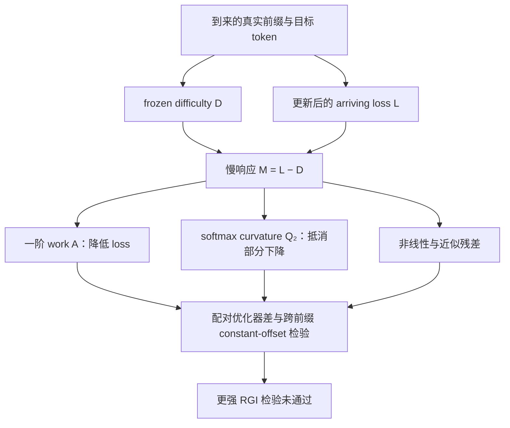
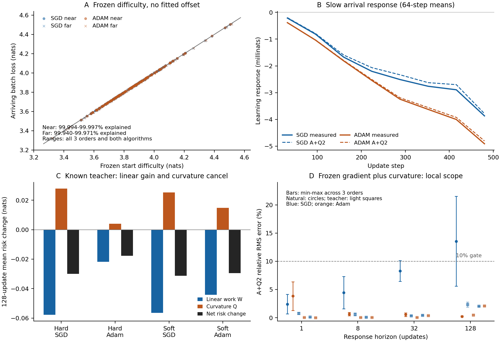

# RGI follow-up：已定位主导项，普遍不变性的机制仍未成立

🤖 Pythia-70M · 🧮 SGD / Adam · 📚 FineWeb sample-10BT · 🔢 512 updates · 🎯 teacher-forced · 📅 2026-10-06

**本次研究完成了有限局部动力学的检验。** 同一批真实前缀和目标 token 上，共同 frozen reference 解释了大部分 arriving-loss 波动。去掉 frozen difficulty 后，负的一阶 work 与正的 softmax curvature 解释了大部分慢响应。两项会抵消，优化器会同时改变两项。实验尚未支持“不同算法共享同一个一阶系数”，也没有证明自然 Transformer 的普遍 strong RGI。

论文为 *Beyond Relative Generalization Invariance: Shared Difficulty and Local Learning Response in Language Model Training*。作者是 Shaoyang Guo、Ziming Liu，Ziming Liu 为通讯作者。单位尚未提供。

## 把用户的直觉变成可测量的项

令 `L` 为更新后的 teacher-forced arriving-batch loss。令 `D` 为同一批数据在 frozen start 上的 loss。令 `M=L-D`。局部更新的精确式为：

$$M=W+Q=A+R+Q.$$

其中，`W` 是 frozen probability 下的 logit-space work。`Q=KL(p₀∥pₜ)≥0` 是 softmax curvature cost。`A=∇θℓθ₀(B)ᵀ(θₜ−θ₀)` 是 frozen batch gradient 对实际参数位移做的一阶 work。`R=W-A` 保留参数到 logits 的非线性残差。`Q₂=½ E[Var_{p₀}(Δz)]` 是 `Q` 的二阶近似。主要检验式是 `M≈A+Q₂`。

“前一阶段更倾向 dog，而下一批出现 cat”的 loss 变化可通过 `D` 测量。自然目标的随机采样项并未因此被单独识别。模型即使不更新，也会对不同 arriving batches 给出不同 loss。这一项无需假定自然文本的真实条件分布已知。共同 reference 和各算法 frozen start 是测量用的 checkpoint，不能称为自然 Bayes 分布。

## 共同难度主导 raw loss 波动

共同官方 step-32000 reference 解释近窗 `96.657–97.578%`、远窗 `96.745–97.582%` 的 raw arriving-loss 方差。各算法自身的 frozen start 解释近窗 `99.9943–99.9974%`、远窗 `99.9400–99.9713%`。这项比较没有拟合斜率或截距。

Frozen-start RMSE 为近窗 `0.000916–0.001330 nats`、远窗 `0.003663–0.004736 nats`。Batch difficulty 的标准差约为 `0.1761–0.2165 nats`。共同数据难度的尺度远大于局部学习响应。因此，很高的 raw loss 一致性可以与有结构的优化器差同时出现。

图中轨迹来自有限实验。范围跨同一数据池的三种排列，不能读成独立数据集上的置信区间。图 B 使用 64-step block means。图 C 展示精确 logit work `W` 与 curvature `Q` 的抵消。

## 一阶 work 与 curvature 主导慢响应

对 `M=L-D`，`A+Q₂` 在六条自然轨迹的近窗、远窗和全窗均通过主要 gate。SGD 的 raw relative RMS error 为 `4.97–9.73%`，Adam 为 `1.19–2.82%`。最低 variance explained 为 `96.87%`。主要 gate 分别要求 relative RMS error 不超过 `10%`、variance explained 不低于 `90%`。

Full-window 均值显示抵消方向。SGD 的 `A` 为 `−0.004011 至 −0.003552 nats`，`Q` 为 `+0.001740 至 +0.001981`，`M` 为 `−0.002153 至 −0.001892`。Adam 的 `A` 为 `−0.003290 至 −0.003272`，`Q` 为 `+0.000609 至 +0.000621`，`M` 为 `−0.002699 至 −0.002690`。

64-step block means 的 signed covariance shares 为 SGD `A=1.51–1.62`、`Q=−0.66 至 −0.54`，Adam `A=1.25–1.26`、`Q=−0.28 至 −0.27`。这些数是抵消敏感的归因系数，不是非负方差比例。负 work 产生 loss 下降，正 curvature 抵消一部分下降。

共同数据项在 `L=D+M` 中的系数为 1，这是分解定义。单步 `A≈−η g_BᵀP_a g_train`；算法更新方向与 Adam moment 会改变这一项。公式形式相同不证明动力学系数相等。本次结果没有验证不同算法的一阶系数相等。`A+Q₂` 使用已经发生的参数位移和 logit 位移，所以它解释有限响应，不能直接预测下一段训练。

## Known teacher 去掉了标签分布的歧义

固定 teacher `q` 后，hard-target loss 可写成 `ℓ=S+C+E`。其中 `S=−log qᵧ`，`C=(q−eᵧ)ᵀv`，`E=KL(q∥p)`。目标由 `q` 采样时，`E_q[C∣x]=0`，population cross-entropy 为 `H(q)+KL(q∥p)`。自然真实条件分布 `r` 未知时，`C=(q−r)ᵀv+(r−eᵧ)ᵀv` 同时包含系统偏差与标签抽样波动。自然 `C` 不能整项称为噪声。

Teacher entropy 均值为 `4.1798397 nats`，sampled surprisal 均值为 `4.1723279`。Student 初始 teacher KL 为 `0.2593348`。128 updates 后，hard SGD 为 `0.229442–0.229879`，hard Adam 为 `0.241563–0.241657`，soft SGD 为 `0.228137–0.228251`，soft Adam 为 `0.229840–0.229902`。Population `A+Q₂` 的平均响应误差最高为 `2.795%`。

去掉标签采样后，constant-offset 仍不成立。优化器差的 cross-prefix standard deviation / absolute mean 为 hard `3.59–3.69`、soft `10.69–11.89`，均超过严格 gate `0.1`。因此，采样噪声不足以解释这次 strong RGI 失败。

## 理论目标的实质性阻碍

单一 global scalar probe 对 `M` 的 relative RMS error 为近窗 `45.1–90.0%`、远窗 `29.5–55.2%`、全窗 `31.7–62.8%`。它缺少 batch-specific sensitivity。SGD 远窗 high-pass error 为 `10.75–16.68%`。主要误差来自 `R=W-A`，该测试中 `Q-Q₂` 低于响应的 `1%`。SGD far 的 64-step block means 仅有两个点；其 90% variance gate 仅 1/3 通过，不能隐藏。

配对优化器响应的 `ΔA+ΔQ₂` 在三种排列上均未通过 `10%` RMS gate。Full-window error 为 `10.34–16.68%`，虽然 variance explained 仍有 `96.74–98.57%`。这表明不能用 raw loss 的高相关替代对较小 optimizer gap 的验证。Full-window 增量满足 `ΔM=ΔW+ΔQ`：`ΔW=−0.000815 至 −0.000322 nats`、`ΔQ=+0.001119 至 +0.001360`、`ΔM=+0.000545 至 +0.000798`。SGD 的更强负 work 被更大 curvature cost 抵消，Adam 在这段得到更多净改善。

论文给出 support-gate 的充分构造：共享 support 内 shape、再乘共享 scalar mass gate，可以产生严格 constant target offset。Dog/cat 数值检查的 gap 为 `0.5901707965`，standard deviation 为 `1.05×10⁻¹⁶`。自然 LLM 是否实现近似 support 与 mass gate 尚未测量。

因此，本次研究已定位有限 continuation 中主导 raw 波动和慢响应的具体项。要实现普遍 strong RGI 的理论目标，仍需实测 candidate support mass、support 内 shape 与 batch-specific response，并在未见训练窗口上做前瞻检验。当前阻碍是实测残差与跨前缀差异，不是缺少一个 loss 分解公式。

## 实验与核验范围

自然实验使用 Pythia-70M、FineWeb sample-10BT revision `9bb295ddab0e05d785b879661af7260fed5140fc`。从 row `65,536` 开始选取 `4,672` 个唯一合格 documents，每个 document 取一个 256-token span。Train/calibration/evaluation split 为 `4096/64/512`。三种 permutation 复用同一池。已登记的旧 ID、text hash 和 span 被排除，选择不使用模型分数。与 Pythia pretraining 的重合未知。

自然追加阶段从各算法先前完成的终态开始，两个起点不同，再运行 512 updates、batch 8。SGD lr=`0.001`。Adam lr=`1e−6`、betas=`(0.9, 0.95)`、epsilon=`1e−8`。Optimizer state 在 continuation 开始时重置。共同 reference 为官方 step-32000，各算法的 frozen start 来自其先前完成的轨迹。窗口为 near `0:128`、far `384:512`、full `0:512`。冻结难度检验在新训练前登记；arrival-work 合同在分析结果出来前固定，但使用已完成的轨迹，属于事后机制诊断。

Known teacher 为官方 step-32000。它从 33-token seed 生成 63 tokens，temperature=`1`，使用完整 `50,304` 词表。Train/calibration/evaluation split 为 `1024/64/128`。Student 从官方 step-16000 开始，运行 128 updates，分别使用 hard sampled target 与 soft teacher distribution。

Extension、logit-work、arrival verifiers 分别通过 `23,220`、`4,159`、`341` checks。最大报告误差为 `8.88×10⁻¹⁵`、`3.17×10⁻¹⁴`、`3.56×10⁻¹⁵`。核验覆盖 saved traces、hashes、代数式、aggregation 与 fixtures。它们没有独立重算完整 network gradients、optimizer trajectories 或全部 raw logits。

论文是 8 页 MetaCircle follow-up。主 PDF 和 19-file arXiv source zip 已用 XeLaTeX 构建。它们尚未上传 arXiv。研究范围是 Pythia-70M local continuation，并非原 RGI 论文 124M/0.7B from-scratch 实验的复现。

## 论文与证据

- [论文 PDF](../../main.pdf)
- [论文 LaTeX](../../main.tex)
- [arXiv source zip](../../rgi-followup-arxiv.zip)
- [机器可读 claims](../../evidence/claims.json)
- [实验证据范围](../../evidence/experiment-summary.md)
- [理论审查](../../evidence/theory-review.md)
- [数字与构建核验](../../evidence/claim-audit.json)
