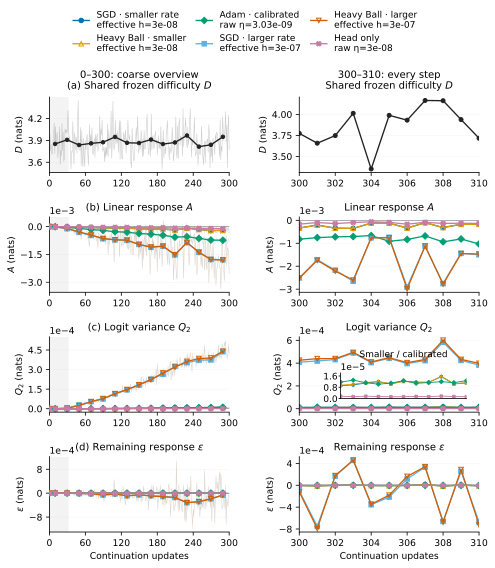
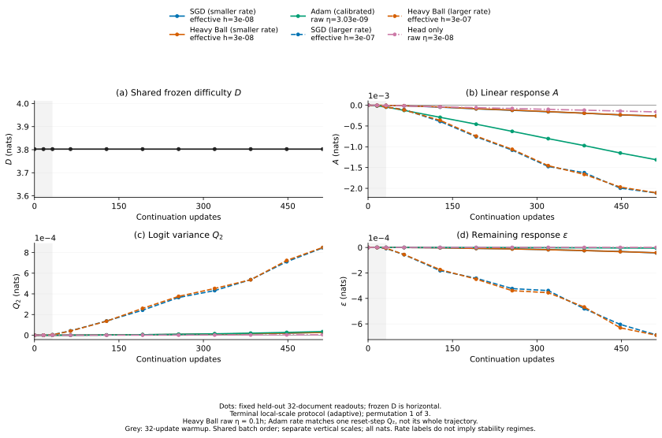

# 共同 checkpoint 的损失分解已定位，严格常数差仍未成立

Pythia-70M step 143000 · FineWeb · 六个训练设置 · 32-step warmup · 每条轨迹 512 updates · 三种配对排列

所有设置从同一个晚期 checkpoint 出发，重置优化器并重新 warmup。冻结难度主导原始 loss 波动。线性响应、logit 方差和实测余项显示各设置的差异。SGD 与 momentum 在较小率下终点位移高度对齐，但严格的非零常数 token loss 差未通过。

论文使用 MetaCircle 模板。Shaoyang Guo 为唯一核心作者，Ziming Liu 为通讯作者。

## 四项能分别测量，共享项只来自相同的评分起点

对当前到达的 batch，在更新它之前评分。D 是冻结起点模型在真实前缀和目标 token 上的 loss。A 是起点 batch 梯度与实际参数位移的点乘。Q₂ 是完整词表上、以起点概率加权的 logit 位移方差的一半。ε 是剩余差值。

$$L_t(B)=D(B)+A_t(B)+Q_{2,t}(B)+\varepsilon_t(B).$$

| 项 | 实测定义 | 物理含义 |
|---|---|---|
| D | 冻结模型的 batch CE | 相同 batch 上所有分支完全共享的难度。 |
| A | g_B(θ₀)ᵀ(θₜ−θ₀) | 沿已发生参数位移的一阶响应，符号可以为负。 |
| Q₂ | ½ mean Varₚ₀(Δz) | 非负的 logit 方差成本。 |
| ε | L−D−A−Q₂ | 网络非线性与 softmax 二阶近似误差。 |

曲线画出预先固定的第一个排列。阴影是 warmup，细线是逐 batch 实测值，粗线是预先规定的 64-step block means。四个纵轴分别使用 nats。D 的波动来自到达 batch 变化。A、Q₂、ε 在起点为零。

## 固定 probe 排除了“冻结模型随时间变化”的误读

固定 probe 包含 32 个留出的 documents。D 在这个 probe 上保持水平线，另外三项随训练展开。主实验包含 SGD、normalized Heavy Ball、Adam，以及仅更新输出头的 SGD。后一个对照保留起点预测函数，只改变更新参数的范围。

终端尺度中，D 对原始到达 loss 的预测解释比例超过 99.9926%，batch 标准差为 0.18530–0.18634 nats。这个结果识别了共享难度的尺度，未识别自然文本的真实条件分布，也未证明各优化器的一阶动力学系数相等。

## 余项被拆开后，网络非线性成为具体阻碍

精确响应为 M=L−D=W+Q=A+R+Q。W 是冻结概率下的 logit 线性作用，Q=KL(p₀∥pₜ) 是精确成本，R=W−A 是参数到 logits 的非线性。因此 ε=R+(Q−Q₂)，一般含二阶网络曲率，不能统称为三阶项。

终端尺度的全窗响应误差 RMS(ε)/RMS(L−D) 为 SGD 10.51–14.96%、Heavy Ball 10.56–15.21%，超过预先规定的 10% 门槛。Adam 为 0.3387–0.3748%，仅输出头 SGD 为 0.002410–0.002470%，通过门槛。SGD/HB 的前 128 arrivals 通过，后 128 arrivals 失败。

全模型 SGD 的 R 的 RMS 为 2.419×10⁻⁵–3.480×10⁻⁵ nats，而 Q−Q₂ 只有 1.349×10⁻⁷–2.588×10⁻⁷。仅输出头时，logits 对被更新参数是仿射函数，R 小于 1.91×10⁻¹⁴ nats。这个对照定位了网络非线性，而非只给余项命名。早期大位移协议则暴露 softmax 二阶近似失败。

## 参数对齐和 token 常数差是两项不同的检验

较小率 SGD/HB 的终点位移 cosine 随三轮率协议从 0.73536–0.75361，上升到 0.99107–0.99500，再到 0.999706–0.999809。这是相同 update 数下的终点比较，尚未证明整条轨迹重合或相同有效进度下的结论。

终端尺度中，SGD/HB 配对响应近似仍有 22.18–28.30% 相对 RMS 误差。最终 probe 上的 token loss 差，中心化 RMS 为 1.460×10⁻⁴–2.936×10⁻⁴ nats，均值绝对值只有 1.569×10⁻⁶–3.141×10⁻⁶。std/|mean| 为 46.49–163.48，远超 0.1 门槛。全部 45 个终端配对测试均未通过严格的非零常数差检验。

*A Journey to the Edge of Stability* 支持低率下固定线性梯度滤波器的 loss/sharpness 轨迹趋近。它不覆盖 Adam，也不证明跨优化器参数轨迹或 token loss 差恒定。我们的相同 batch 流 momentum 恒等式给出一个受条件约束的连接，详见论文与[文献核查](../../evidence/literature-audit.md)。

三个协议各有 18 条已完成轨迹，总计 54 条，独立记录核验通过 6,834 项检查。后两轮率协议是看到失败后自适应登记的，前两轮和所有排列均保留。三种排列复用一个 FineWeb 池，固定 512 updates 不等于固定有效进度。该研究是晚期 Pile checkpoint 在 FineWeb 上的有限续训，不能转写为原 RGI from-scratch 实验的复现或普遍反证。

[论文 PDF](../../paper/main.pdf) · [arXiv source zip](../../paper/rgi-followup-arxiv.zip) · [当前 claims](../../evidence/common-claims.json) · [证据范围](../../evidence/experiment-summary.md) · [历史不同起点面板](rgi-followup-panel.html)
